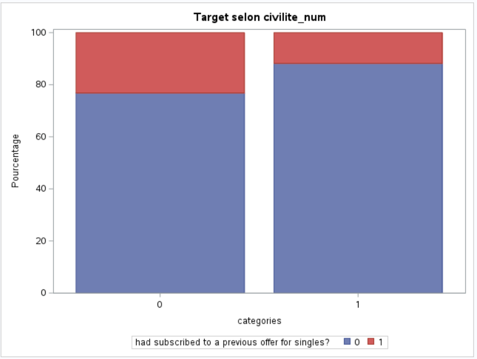
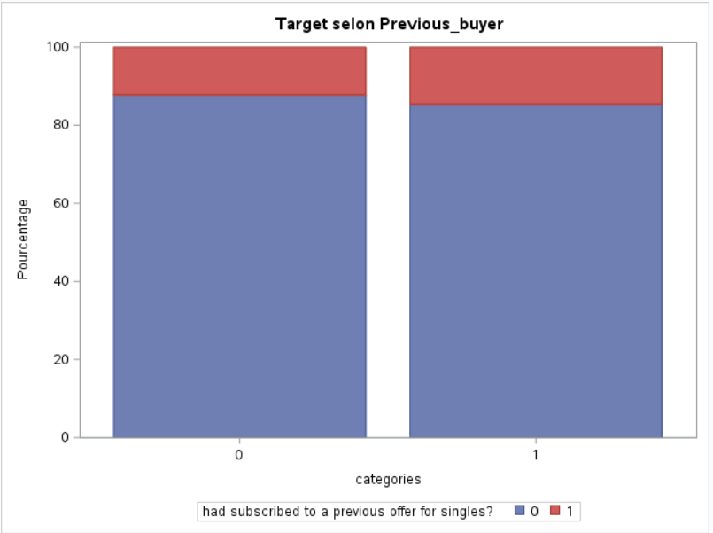
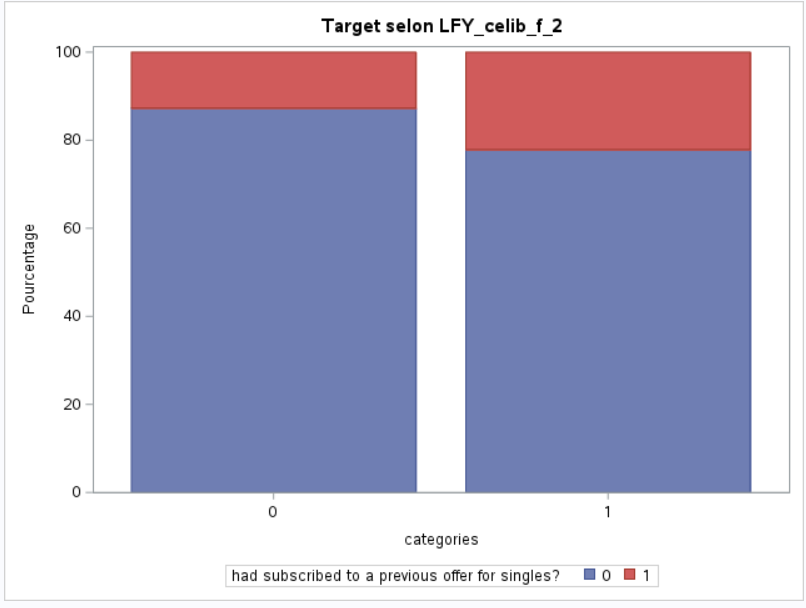
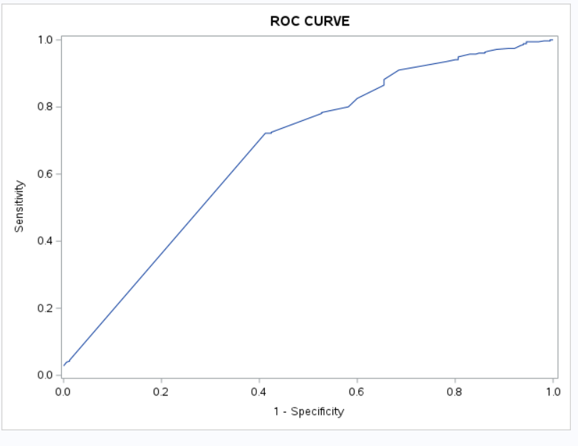

# Customer churn prediction using Logistic Regression with SAS and Python : Overview 

The company “Envies d’Ailleurs” is specialized in holidays and travel within the European Union and abroad.
The goal of the marketing department for the upcoming year is to identify the company’s potential growth opportunities.
To achieve this, target analyses must be carried out, and commercial development actions must be proposed.

In this study, our first objective will be to determine the targeting criteria for upcoming holiday offers dedicated to single customers. Then, we will set up a platform that allows each sales representative to know a client’s score and decide whether they are a good prospect or not.

Initial dataset: 6,387 rows and 326 variables.

**Tools and Technologies  :** 

>- **SAS** (PROC UNIVARIATE, PROC FREQ, PROC MEANS, PROC LOGISTIC)
>- **Python** and **Streamlit** for code industrialization and deployement
>- **Git** for version control

# Project steps, visualizations and results:

**1 - Preprocessing steps**

The dataset is composed of several binary variables representing whether customers subscribed to a travel offer. For example:
*AGENCE_2*: Equals 1 if the customer subscribed to an in-agency offer in year -2;
*ENF_0_2ANS_8*: Equals 1 if the customer subscribed to an offer for children aged 0 to 2 in year -8.

Today, we are in year 0 and we want to build a scoring model based on year -1 in order to create a training dataset and a test dataset. We therefore started by:

>- **Removing all variables from year -1 except those related to our target offer (offer for single customers)**

Our target variable will be a binary variable that equals 1 if at least one variable related to the target offer equals 1:
Target = 1 if celibat_1 = 1 or celib_F_1 = 1, otherwise 0.

>- **Grouping variables corresponding to the same offers across years :**

We proceeded as follows:
LFY_hotel_2 = 1 if hotel_2 = 1 or hotel_3 = 1 or hotel_4 = 1 or hotel_5 = 1 otherwise 0. 
MT5Y_hotel_6 = 1 if hotel_6 = 1 or hotel_7 = 1 or hotel_8 = 1 or hotel_9 = 1 otherwise 0. 

LFY_hotel_2 therefore represents the subscription to at least one hotel stay offer during the four years preceding year -1, with LFY meaning “Last Four Years”.

MT5Y_hotel_6 represents the subscription to at least one hotel stay offer during the four years preceding the four years before year -1, with MT5Y meaning “More Than Five Years”.

>- **Transforming quantitative variables:**

1-/ Transformation of the variable *agereel* into multiple binary categorical variables according to the following categories:

-*Under 25 (included)*

-*From 26 to 35 (included)*

-*From 36 to 49 (included)*

-*From 50 to 64 (included)*

-*Over 65 (included)*

2-/ Creation of the variables LFY_valca, Previous_buyer, SMALL_buyer, AVERAGE_buyer, BIG_buyer with:

LFY_valca = valca_s2 + valca_s3 + valca_s4 + valca_s5

Previous_buyer = 1 if LFY_valca is not null

SMALL_buyer = 1 if LFY_valca ≤ 600

AVERAGE_buyer = 1 if LFY_valca ≤ 1500

BIG_buyer = 1 if LFY_valca > 1500

valca_s2 originally represents the amount spent in year -2, and following the same logic, LFY represents the total amount spent by customers during the four years preceding year -1.

3-/ Finally, removing variables with too little data to perform imputation.

**2 - Statistical Analysis and visualizations**

>- **Chi-square test**
Once our preprocessing was completed, we studied the relationship between our features and our target variable using the chi-square test:

Test hypothesis:
\begin{cases}
H_0 : \text{Independence between the feature and the target} \\
H_1 : \text{Reject of null hypothesis}
\end{cases}

Rule: if p-value < threshold (= 0.05), then we reject the null hypothesis.

By performing this test and also calculating **Cramer's V coefficient**, we found that the variables most strongly associated with our target are:
civilite_num, BIG_buyer, SMALL_buyer, Previous_buyer, civilite, LFY_ENF_14_16ANS_2, LFY_grou_enf_2, LFY_FAMILY_2,
LFY_celib_f_2, LFY_celibat_2, LFY_hotel_2, MT5Y_AGENCE_6, MT5Y_ENF_14_16ANS_6, MT5Y_trekking2_6,
MT5Y_therme_6, MT5Y_sej_CAP_6, MT5Y_celib_f_6, MT5Y_celibat_6, TARGET

**Visualizations :** 

By observing these charts, we can see that unlike the variable previous_buyer, the variables LFY_celib_f_2 and civilite_num have a different distribution of the target variable across each of their categories.
For example, the proportion of men who subscribed to a single customer offer is higher than that of women; the proportion of customers who subscribed to a women-only single-customer offer in year -2 is greater than for those who did not.

**3 – Modelling**

We built a logistic regression model using the PROC LOGISTIC procedure in SAS. To do so, we split our dataset into a training set and a test set, then generated an initial model with all variables and removed non-significant variables according to the **Likelihood-Ratio test**.

Given the imbalance between the classes of our target variable, we opted for a 1:2 ratio, meaning two times more majority-class observations than minority-class observations.
The best model we obtained achieved an **AUC score of 0.67**.

**4 - Deployment with Python and Streamlit**

Once the model was validated, we exported the corresponding coefficients into a CSV file stored within the project directory in VS Code.
We then developed several Python modules dedicated to data preprocessing, score computation, and the integration of these components within the Streamlit application.

# Licence and Contact Information : 
You are free to use clone and use this project as your wish.

**Clone project :** 
git clone https://github.com/MayeneBS99/Affinity_Score_with_SAS_and_Python

If you have any questions or suggestions, feel free to reach me out on my LinkedIn https://www.linkedin.com/in/sch%C3%A9kina-mayene-2a5931244/ or Email: Mayene2212@gmail.com